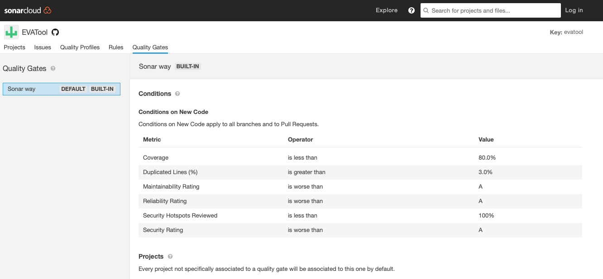

## Why is there need for such a decision?

We need to define what our quality Standards for our Code are.

At the moment it is set to default value.

(Please explain in 1-2 sentences why this is necessary to decide, and why it is a decision on the respective level
must / should / team)

## Additional sources for better understanding the background

(Please list some sources where a reader can get a better understanding of the topic at hand)

## Viable Options

(Please list those options that you seriously consider as a possible solution. Simple bulleted list with a brief 
1-sentence explanation is sufficient.)

## Alternatives not seriously considered

(Here comes a list of alternatives that you can exclude right away, without an in-depth evaluation. Format: 
Simple bulleted list with a brief 1-sentence explanation is sufficient.)

## How is this decision evaluated?

(**Before** you start working in this, please write down how you will evaluate this decision, and plan to 
come to a resolution. 
It is  **not sufficient** to perform a brief Google search, and then write  the "result" down. Any decision must
**always** be based on a thorough evaluation - if possible hands-on, i.e. by coding a brief proof-of-concept.
if this doesn't apply, then some other means of proper research must be given here - e.g. an evaluation of 
the most relevant literature or IT community sources.) 

 
## Resolution Details

(If the resolation cannot be explained in 1-2 sentences, usually this section would contain a link to some
documentation in the Github wiki.)

## Reasons for the resolution

(Please explain in 1-2 sentences, why you ultimately opted for this resolution, and not for an alternative one.)

