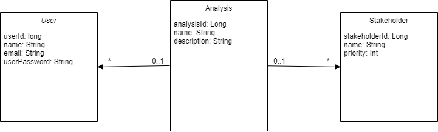

## Why is there need for such a decision?

Before implementing, it’s important to create a matching domain model. This way, we can consider the main objects of the domain and their relationships. With this method, the whole improved understanding for the domain will lead to a better implementation. 

## Additional sources for better understanding the background

- [Ethiktool - Wireframe](https://lsw4em.axshare.com/prototype/login/lsw4em#id=wvfe6y&p=website)
- [Domain-Driven Design	Reference](https://www.domainlanguage.com/wp-content/uploads/2016/05/DDD_Reference_2015-03.pdf)
- [Domain Driven Design - Tackling Complexity in the Heart of Business Software](http://citeseerx.ist.psu.edu/viewdoc/download?doi=10.1.1.13.326&rep=rep1&type=pdf)
- [An introduction to Domain-Driven Design](https://medium.com/inato/an-introduction-to-domain-driven-design-386754392465)
- [Domain Modeling](http://www.cs.sjsu.edu/~pearce/modules/lectures/ooa/analysis/DomainModeling.htm)

## Viable Options

Best practice at this point is the domain model…

## Alternatives not seriously considered

… This is the reason why no other alternatives were considered.

## How is this decision evaluated?

Based on the [wireframe]( https://lsw4em.axshare.com/prototype/login/lsw4em#id=wvfe6y&p=website) and the given [Excel-file](https://github.com/Archi-Lab/elsi-by-design-excel/), a first version of the domain model will be created. This version will be improved with several attributes and relationships.

## Resolution Details

## Reasons for the resolution

The design-decision for the domain model is needed to work with the whole domain itself.
